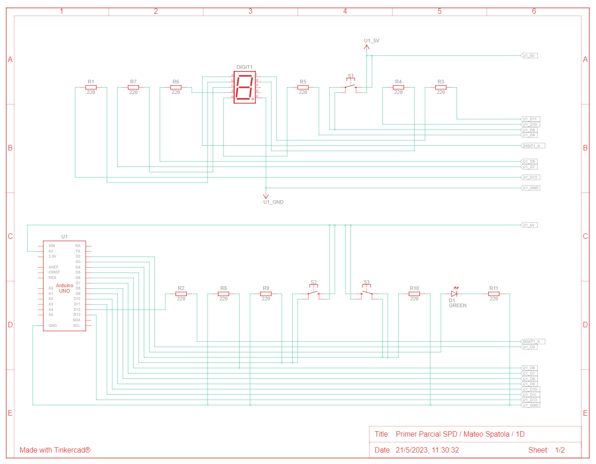
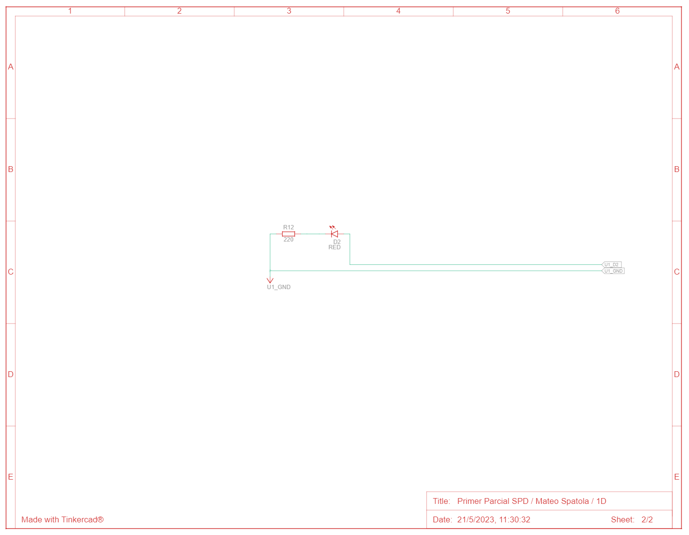

# Primer Parcial SPD (Parte Práctica Domiciliaria)

## Alumno
- Spatola Mateo

## Proyecto: Montacargas.

## Descripción
Se nos pide armar un modelo de montacarga funcional como maqueta para un hospital. El objetivo es que implementes un sistema que pueda recibir ordenes de subir, bajar o pausar desde diferentes pisos y muestre el estado actual del montacargas en el display 7 segmentos.

Requisitos del Proyecto:
1) Interfaz de usuario:
- Deberá haber 3 botones, uno para subir pisos, otro para bajar pisos y otro para detener el montacarga.
- Deberá tener 2 LEDs, uno verde que indicará cuando el montacarga este en movimiento, otro rojo que indique cuando el montacarga esté pausado.
- En el display 7 segmentos deberán informar en tiempo real en qué piso se encuentra el elevador.
- Se sabe que el tiempo de trayecto entre pisos es de 3 segundos (3000 ms).
- Se deberá informar por monitor serial el piso en el que se encuentra el montacarga, este en funcionamiento o en pausa.

2) Funcionamiento del montacarga:
- Implementa un algoritmo que permita que el elevador suba y baje o frene presionando los botones correspondientes.
- Deberán buscar una forma para pausar el montacargas cuando el usuario lo determine.

3) Documentación:
- Deberán presentar un diagrama esquemático del circuito y explicar el funcionamiento aplicado de cada componente.
- Presentar el código fuente del proyecto de Arduino listo para ser implementado.
- Deberán explicar el funcionamiento integral utilizando documentación MarkDown.

## Función principal
El codigo hace uso de varias funciones para hacer funcionar el montacargas, el cual esta conformado por un display 7 segmentos (que indica el piso actual en el que se encuentra el montacargas), por 3 botones (uno para subir, otro para detener, y otro para bajar el montacargas) y por 2 leds que indican si el montacargas se encuentra detenido (led rojo) o en movimiento (led verde).
Las funciones principales son las de subir(), detener() y bajar(), ya que estas son las que indican el procedimiento que debera hacer el montacargas dependiendo de cual sea requerida:

~~~ C (lenguaje en el que esta escrito)
void subir()
{
  if(pisoActual != 9)
  {
    apagarLed(LED_ROJO);
    prenderLed(LED_VERDE);
    flagMensajeDetener = false;
    flagMensajeBajar = false;
    
    estadoNumeroDisplay(pisoActual,1);
    Serial.println("Subiendo...");
    habilitarBotonesPorUnTiempo(3000);
    pisoActual ++;
    estadoNumeroDisplay(pisoActual,1);
    Serial.print("Estas en el piso: ");
    Serial.println(pisoActual);
  }
  else
  {
    if(flagMensajeSubir == false)
    {
      Serial.println("Montacargas detenido en ultimo piso.");
      subiendo = false;
      detenido = true;
      flagMensajeSubir = true;
    }
  }
}
~~~

~~~ C (lenguaje en el que esta escrito)
void detener()
{
  prenderLed(LED_ROJO);
  apagarLed(LED_VERDE);
  if(flagMensajeDetener == false)
  {
    estadoNumeroDisplay(pisoActual,1);
    Serial.print("Montacargas detenido. Estas en el piso: ");
    Serial.println(pisoActual);
    flagMensajeDetener = true;
    if(pisoActual == 0)
  	{
      flagMensajeBajar = true;
    }
    if(pisoActual == 9)
  	{
      flagMensajeSubir = true;
    }
  }
}
~~~

~~~ C (lenguaje en el que esta escrito)
void bajar()
{
  if(pisoActual != 0)
  {
    apagarLed(LED_ROJO);
  	prenderLed(LED_VERDE);
    flagMensajeSubir = false;
  	flagMensajeDetener = false;
    
    estadoNumeroDisplay(pisoActual,1);
    Serial.println("Bajando...");
    habilitarBotonesPorUnTiempo(3000);
    pisoActual --;
    estadoNumeroDisplay(pisoActual,1);
    Serial.print("Estas en el piso: ");
    Serial.println(pisoActual);
  }
  else
  {
    if(flagMensajeBajar == false)
    {
      Serial.println("Montacargas detenido en planta baja.");
      bajando = false;
      detenido = true;
      flagMensajeBajar = true;
    }
  }
}
~~~

### Botones
Otras funciones importantes son las de lectura de botones, ya que gracias a ellas el usuario puede decidir cual es el funcionamiento que quieren que realice el montacargas:
~~~ C (lenguaje en el que esta escrito)
void leerEstadoBotonSubir()
{
  estadoBotonSubir = digitalRead(BOTON_SUBIR);
  if(estadoBotonSubir == 1)
  {
    if(subiendo == false)
    {
      Serial.println("Boton subir presionado");
      subiendo = true;
      detenido = false;
      bajando = false;
      if(pisoActual == 9)
      {
        Serial.println("Ya estas en el ultimo piso!");
      }
    }
  }
}
~~~

~~~ C (lenguaje en el que esta escrito)
void leerEstadoBotonDetener()
{
  estadoBotonDetener = digitalRead(BOTON_DETENER);
  if(estadoBotonDetener == 1)
  {
    if(detenido == false)
    {
      Serial.println("Boton detener presionado");
      subiendo = false;
      detenido = true;
      bajando = false;
      if(flagMensajeDetener == true)
      {
        Serial.println("Ya estas detenido");
      }
    }
  }
}
~~~

~~~ C (lenguaje en el que esta escrito)
void leerEstadoBotonBajar()
{
  estadoBotonBajar = digitalRead(BOTON_BAJAR);
  if(estadoBotonBajar == 1)
  {
    if(bajando == false)
    {
      Serial.println("Boton bajar presionado");
      subiendo = false;
      detenido = false;
      bajando = true;
      if(pisoActual == 0)
      {
        Serial.println("Ya estas en planta baja!");
      }
    }
  }
}
~~~

Gracias a la funcion habilitarBotonesPorUnTiempo(int tiempo) el usuario puede con solo presionar una vez (mientras el montacargas se encuentra en movimiento) elegir si quiere ir en otra direccion, o detenerlo cuando llegue al proximo piso sin necesidad de mantener apretado dicho boton:
~~~ C (lenguaje en el que esta escrito)
void habilitarBotonesPorUnTiempo(int tiempo)
{
  int acumuladorTiempo = 0;
  while(acumuladorTiempo < tiempo)
  {
    delay(50);
    leerEstadoBotones();
    acumuladorTiempo += 50;
  }
}
~~~

### Display 7 segmentos 
El manejo y funcionamiento del display 7 segmentos consta de dos funciones.

Esta funcion permitira optimizar las lineas de codigo, controlando por parametros el estado de cada led del display, pudiendo ser HIGH o 1 para encender el led, o LOW o 0 para apagar el led:
~~~ C (lenguaje en el que esta escrito)
void estadoLedsDisplay(int A, int B, int C, int D, int E, int F, int G)
{
  digitalWrite(LED_A, A);
  digitalWrite(LED_B, B);
  digitalWrite(LED_C, C);
  digitalWrite(LED_D, D);
  digitalWrite(LED_E, E);
  digitalWrite(LED_F, F);
  digitalWrite(LED_G, G);
}
~~~

Luego, haciendo uso de la funcion anterior, podemos encender o apagar el numero que querramos (entre el 0 y el 9), pasandolo por parametro:
~~~ C (lenguaje en el que esta escrito)
void estadoNumeroDisplay(int numero, int estado)
{
  switch(numero)
  {
    case 0:
    	estadoLedsDisplay(estado,estado,estado,estado,estado,estado,0);
    	break;
    case 1:
    	estadoLedsDisplay(0,estado,estado,0,0,0,0);
    	break;
    case 2:
    	estadoLedsDisplay(estado,estado,0,estado,estado,0,estado);
    	break;
    case 3:
    	estadoLedsDisplay(estado,estado,estado,estado,0,0,estado);
    	break;
    case 4:
    	estadoLedsDisplay(0,estado,estado,0,0,estado,estado);
    	break;
    case 5:
    	estadoLedsDisplay(estado,0,estado,estado,0,estado,estado);
    	break;
    case 6:
    	estadoLedsDisplay(estado,0,estado,estado,estado,estado,estado);
    	break;
    case 7:
    	estadoLedsDisplay(estado,estado,estado,0,0,0,0);
    	break;
    case 8:
    	estadoLedsDisplay(estado,estado,estado,estado,estado,estado,estado);
    	break;
    case 9:
    	estadoLedsDisplay(estado,estado,estado,estado,0,estado,estado);
    	break;
  }
}
~~~

### Leds: verde y rojo
Haciendo uso de las funciones prenderLed(int led) y apagarLed(int led) podemos prender o apagar el led que le pasamos por parametro e imprimirlo por serial:
~~~ C (lenguaje en el que esta escrito)
void prenderLed(int led)
{
  switch(led)
  {
    case LED_VERDE:
    if(flagLedVerdeEncendido == false)
    {
      Serial.println("Led verde encendido");
      flagLedVerdeEncendido = true;
    }
    break;
    case LED_ROJO:
    if(flagLedRojoEncendido == false)
    {
      Serial.println("Led rojo encendido");
      flagLedRojoEncendido = true;
    }
    break;
  }
  digitalWrite(led, HIGH);
}
~~~

~~~ C (lenguaje en el que esta escrito)
void apagarLed(int led)
{
  switch(led)
  {
    case LED_VERDE:
    if(flagLedVerdeEncendido == true)
    {
      Serial.println("Led verde apagado");
      flagLedVerdeEncendido = false;
    }
    break;
    case LED_ROJO:
    if(flagLedRojoEncendido == true)
    {
      Serial.println("Led rojo apagado");
      flagLedRojoEncendido = false;
    }
  }
  digitalWrite(led, LOW);
}
~~~

### Loop
En el loop principal se hace uso de la funcion leerEstadoBotones(), para saber dependiendo de que boton fue pulsado, que hara el montacargas.
Ni bien se inicie el programa, el montacargas se encontrara detenido en el piso 0 con el led rojo prendido.

Si el boton pulsado fue "subir", se apagara el led rojo y se encendera el led verde, luego el montacargas comenzara a subir hasta llegar al ultimo piso, tardando 3 segundos por cada piso, indicando por el display en que piso se encuentra.
Cuando llegue al ultimo piso, el montacargas se detendra.
Si se pulsa el boton estando en el ultimo piso, se mantendra detenido y se indicara por serial que el montacargas ya se encuentra en el ultimo piso.

Si el boton pulsado fue "detener", se encendera el led rojo y se apagara el led verde, luego se detendra cuando llegue al siguiente piso indicando por el display en que piso se encuentra.
Si se pulsa el boton estando detenido, se mantendra detenido y se indicara por serial que el montacargas ya se encuentra detenido.

Si el boton pulsado fue "bajar", se apagara el led rojo y se encendera el led verde, luego el montacargas comenzara a bajar hasta llegar a planta baja, tardando 3 segundos por cada piso, indicando por el display en que piso se encuentra.
Cuando llegue a planta baja, el montacargas se detendra.
Si se pulsa el boton estando en planta baja, se mantendra detenido y se indicara por serial que el montacargas ya se encuentra en planta baja.
~~~ C (lenguaje en el que esta escrito)
void loop()
{
  leerEstadoBotones();
  
  if(subiendo == true)
  {
    subir();
  }
  if(detenido == true)
  {
    detener();
  }
  if(bajando == true)
  {
    bajar();
  }  
}
~~~

## Diagrama esquemático del circuito

### Funcionamiento aplicado de cada componente
#### Pulsadores:
Todos los pulsadores fueron conectados mediante una configuracion pull down (HIGH o 1 cuando es presionado, y LOW o 0 cuando no lo es).
- S1: Terminales 1a y 1b conectados a una resistencia (R8) de 220ohms a GND del Arduino Uno (U1) y al pin D6 (entrada digital) del U1. Terminales 2a y 2b conectados a 5V del U1.
- S2: Terminales 1a y 1b conectados a una resistencia (R9) de 220ohms a GND del Arduino Uno (U1) y al pin D5 (entrada digital) del U1. Terminales 2a y 2b conectados a 5V del U1.
- S3: Terminales 1a y 1b conectados a una resistencia (R10) de 220ohms a GND del Arduino Uno (U1) y al pin D4 (entrada digital) del U1. Terminales 2a y 2b conectados a 5V del U1.

#### Visualizador de 7 segmentos (DIGIT1):
Tiene 7 leds integrados (A,B,C,D,E,F,G) los cuales se encienden cuando reciben un HIGH o 1 y se apagan cuando reciben un LOW o 0.
En este proyecto son encendidos en conjunto para mostrar los numeros del 0 al 9.
- a: "A" conectado a una resistencia (R2) de 220 ohms al pin D12 (salida digital) del U1.
- b: "B" conectado a una resistencia (R1) de 220 ohms al pin D13 (salida digital) del U1.
- c: "C" conectado a una resistencia (R7) de 220 ohms al pin D7 (salida digital) del U1.
- d: "D" conectado a una resistencia (R6) de 220 ohms al pin D8 (salida digital) del U1.
- e: "E" conectado a una resistencia (R5) de 220 ohms al pin D9 (salida digital) del U1.
- f: "F" conectado a una resistencia (R3) de 220 ohms al pin D11 (salida digital) del U1.
- g: "G" conectado a una resistencia (R4) de 220 ohms al pin D10 (salida digital) del U1.
- K: "Comun" conectado a GND del U1.

#### Leds:
Los leds son encendidos cuando sus salidas digitales reciben un HIGH o 1 y se apagan cuando reciben un LOW o 0.
- D1 GREEN: El catodo esta conectado a GND del U1. El anodo esta conectado a una resistencia (R11) de 220 ohms al pin D3 (salida digital) del U1.
- D2 RED: El catodo esta conectado a GND del U1. El anodo esta conectado a una resistencia (R12) de 220 ohms al pin D2 (salida digital) del U1.

## :robot: Link al proyecto
- [Proyecto](https://www.tinkercad.com/things/jZebBGVqYfF)
