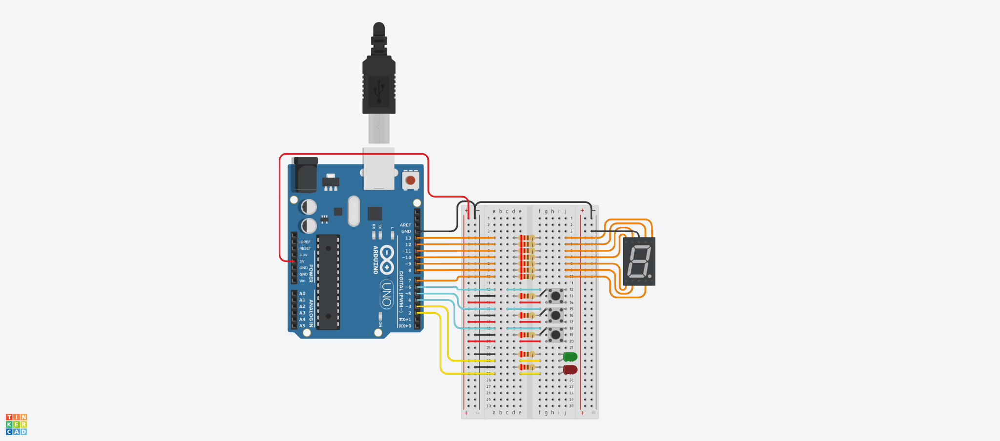

# Primer Parcial SPD (Parte Práctica Domiciliaria)

## Alumno
- Spatola Mateo

## Proyecto: Montacargas.

## Descripción
Se nos pide armar un modelo de montacarga funcional como maqueta para un hospital. El objetivo es que implementes un sistema que pueda recibir ordenes de subir, bajar o pausar desde diferentes pisos y muestre el estado actual del montacargas en el display 7 segmentos.

Requisitos del Proyecto:
1) Interfaz de usuario:
- Deberá haber 3 botones, uno para subir pisos, otro para bajar pisos y otro para detener el montacarga.
- Deberá tener 2 LEDs, uno verde que indicará cuando el montacarga este en movimiento, otro rojo que indique cuando el montacarga esté pausado.
- En el display 7 segmentos deberán informar en tiempo real en qué piso se encuentra el elevador.
- Se sabe que el tiempo de trayecto entre pisos es de 3 segundos (3000 ms).
- Se deberá informar por monitor serial el piso en el que se encuentra el montacarga, este en funcionamiento o en pausa.

2) Funcionamiento del montacarga:
- Implementa un algoritmo que permita que el elevador suba y baje o frene presionando los botones correspondientes.
- Deberán buscar una forma para pausar el montacargas cuando el usuario lo determine.

3) Documentación:
- Deberán presentar un diagrama esquemático del circuito y explicar el funcionamiento aplicado de cada componente.
- Presentar el código fuente del proyecto de Arduino listo para ser implementado.
- Deberán explicar el funcionamiento integral utilizando documentación MarkDown.

## Función principal
.....

~~~ C (lenguaje en el que esta escrito)

~~~

~~~ C (lenguaje en el que esta escrito)

~~~

## :robot: Link al proyecto
- [Proyecto](https://www.tinkercad.com/things/jZebBGVqYfF)